# Azure IoT Central Application ハンズオン

## 1. ハンズオン 内容

Azure IoT Central Applicationを利用して、  
IoT機器からの情報収集・可視化・アラート通知機能を構築します。

- デバイスから上がってくる温度・湿度・気圧を管理する。
  - デバイスの接続、テレメトリの受信
  - データの可視化 (グラフ表示)
  - ダッシュボードの作成  
  
  

- 温度が35℃を超えたら「熱中症注意」のメールを送信。  
  - ルールの設定  
  - アクションの設定  
  
  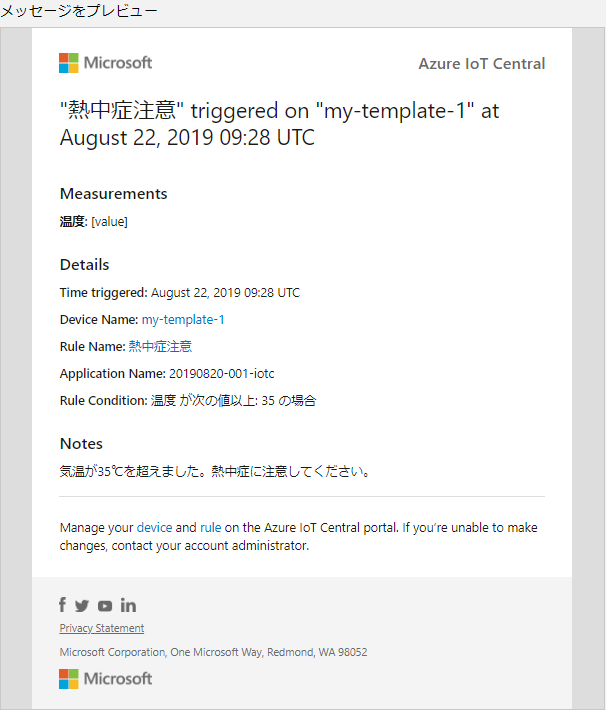

## 2. IoT Central Applicationを使ってみよう

IoT Centralは、Azureが展開しているIoTのSaaS(Software as a Service)です。

IoT Centralでは、IoT機器からの情報収集、蓄積、可視化、アラートなどの機能を  
SaaSとして提供しています。

IoTを始めるにあたって、典型的なパターンは以下のものかと思います。

- IoT機器にクラウド接続アプリをデプロイ。
- クラウドに上がってきたデータの蓄積(データベース等)
- 蓄積データの可視化 (データ表示アプリの作成)
- 送信データによるアクション(異常検知時のメール送信)

この場合、  

- データベースを準備
- データの可視化アプリを作成
- イベント検知時のアクション作成

が必要であり、個々のクラウドサービスを連携させたり、アプリの開発が必要でした。

しかし、IoT Centralではデバイス接続、蓄積・可視化、分析、異常検知やそれに対するアクション設定、  
デバイスへのコマンド送信など、IoTを始めるにあたり必要な機能が簡単に使えるようになっています。  
デバイス側の接続アプリの作成・デプロイは必要ですが、それ以外はコーディングなしで利用できます。

### 2-1. IoT Central Applicationを構築しよう

では、さっそくIoT Centralを体験してみましょう。
Azure PotalからIot Centralを作成します。

1. Azure Potalを開きます。

2. 画面左のメニューから、「リソースの作成」をクリック。  
   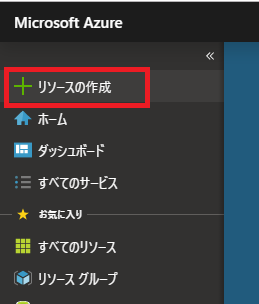
   <br>

3. 検索フィールドに`IoT Central Application`を入力し検索。  
   
   <br>

4. 「IoT Central アプリケーション」が表示されるのでクリック。  
   
   <br>

   「作成」をクリックします。  
    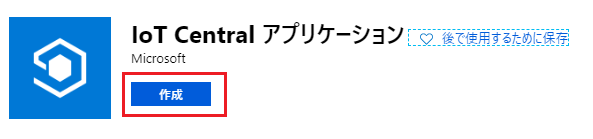
    <br>

5. 必要な情報を入力し「作成」をクリックします。
   1. リソース名：「日付：yyyymmdd>-<席番号>-iotc」  
      (※アプリケーションURLも併せて自動入力されます。)
   2. サブスクリプション：ご自身のサブスクリプションを選択
   3. リソースグループ：`新規作成`をクリックし、「iot-central-hands-on」とする。
   4. テンプレート：「カスタムアプリケーション」
   5. 場所：米国東部  

   <br>
   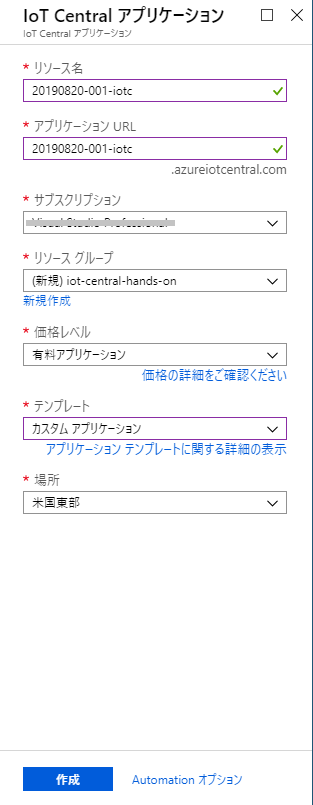
   <br>

6. 作成には少し時間がかかります。焦らず待ちましょう。  
   作成が完了すると下記の通知が表示されますので、  
   「リソースに移動」をクリックします。  
   
   
   <br>

7. Iot Central Applicationの概要画面が表示されますので、  
   `IoT Central アプリケーションのURL`をクリックしてみましょう。

   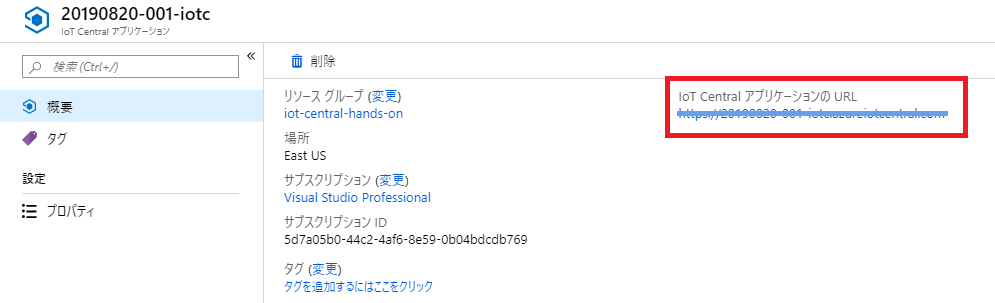
   <br>

8. IoT Central Applicationが表示されます。
   <br>  
   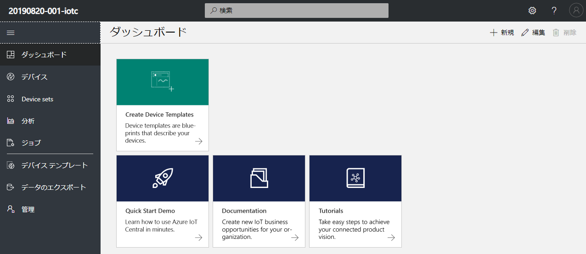

### 2-2. デバイステンプレート作ってみよう

デバイステンプレートは、接続する機器のテンプレートです。

接続する機器も様々です。

- Arduino
- Raspberry Pi

といった機器の違いもあれば、同じ機種でも、用途によろ通信内容にも違いがあります。

接続機器は1台とは限りません。何百台もの機器を展開する場合もあります。  
その際、一台一台設定していては、きりがないですね。

そこで、テンプレートがあるわけです。

デバイステンプレートは接続機器の、  

- 通信内容
- 制御のルール
- 送信データのグラフ化・表示内容

などが設定できます。

では、早速作ってみましょう。

1. 画面左のメニューから「デバイステンプレート」をクリックします。  
   
   <br>

2. 画面右上の「＋ (新規)」をクリックします。  
   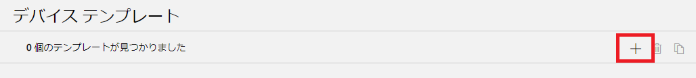
   <br>

3. 代表的な機器のテンプレートが表示されます。  
   今回は「カスタム」を選択します。  
   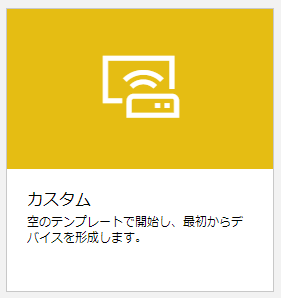
   <br>

4. テンプレート名を入力しましょう。  
   今回は「my-template」とします。  
   入力したら「作成」をクリックします。  
   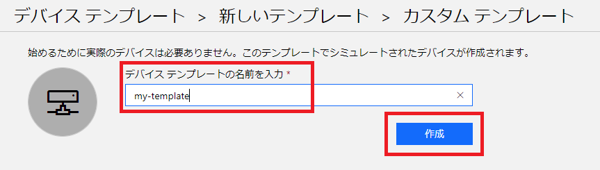
   <br>

5. テンプレートが作成されました。ここから、接続する機器に関する設定を行っていきます。  
   先ずは「測定」から設定します。この「測定」には機器から送られてくるデータを登録します。  
   例えば、センサーで検知した温度や湿度などです。  
   
   <br>

   「測定」タブを選択し、「＋新規」をクリックしてください。  
   表示されたメニューから「テレメトリ」を選択します。  
   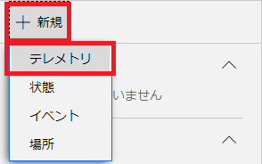
   <br>

6. テレメトリは、機器から送られてくる計測データです。  
   IoT機器からは、センサーで計測したデータをJSON形式で送信します。

   ```javascript
   // 送信例
   {
       "temperature": 28.0234,    // 温度
       "humidity": 56.2934,       // 湿度
       "pressure": 989.2229,      // 気圧
       "assetloc": {              // 場所
           "lon": 140.2220,       // 経度
           "lat": 39.0023         // 緯度
       }
   }
   ```

   ここでは、送信されてくるデータの中から、蓄積・表示したい項目を登録します。
   今回は、デバイスから上記の温度、湿度が送られてくるものとしましょう。

   では、温度を設定してみます。

   - Display Name : 温度
     - 画面に表示する際の「表示名」です。

   - フィールド名 : temperature
     - デバイスから送られてくるデータの項目名です。

   - 単位：℃
     - 送られてくるデータの単位です。

   - 最小値：-20
     - 送られてくるデータの最小値です。  
       この値を下回る値は、有効データとして扱われません。

   - 最大値：50
     - 送られてくるデータの最大値です。  
       この値を上回る値は、有効データとして扱われません。

   - 小数点以下桁数：2
     - 小数で送信されてくる場合の有効桁数です。(四捨五入されます。)  
       グラフでのデータ表示時に使用されます。
       未指定の場合は、送信データの桁数で扱われます。

   - カラー： (赤)
     - グラフ表示時のカラーを指定します。  

   <br>
   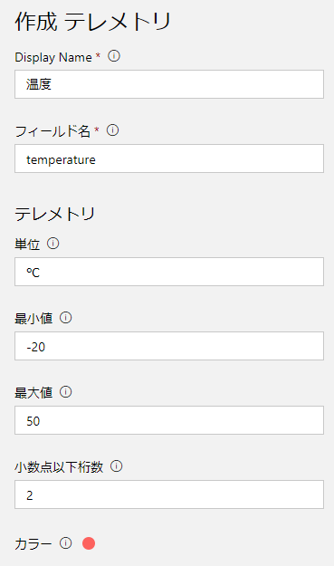
   <br>

   入力が完了したら、「保存」をクリックし保存します。  
   
   <br>

7. 同様に、湿度・気圧を定義しましょう。  

   **湿度**  
   - 「+ 新規」～「テレメトリ」
   - Display Name : 湿度
   - フィールド名 : humidity
   - 単位：%
   - 最小値：0
   - 最大値：100
   - 小数点以下桁数：2
   - カラー： (青)
   - 入力が完了したら、「保存」をクリックし保存します。  

   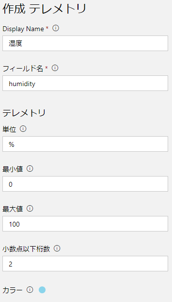
   <br>

   **気圧**  
   - 「+ 新規」～「テレメトリ」
   - Display Name : 気圧
   - フィールド名 : pressure
   - 単位：hPa
   - 最小値：800
   - 最大値：1200
   - 小数点以下桁数：2
   - カラー： (オレンジ)
   - 入力が完了したら、「保存」をクリックし保存します。  
  
   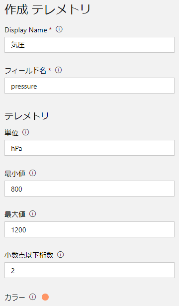
   <br>

8. 次に場所を設定します。

   - 「+ 新規」～「場所」  
   

   - Display Name : 場所  
   - フィールド名 : assetloc  

   

   - 入力が完了したら、「保存」をクリックし保存します。

   <br>

9. これで受信データの表示ができます。  
   画面上には、温度と湿度のシミュレーションデータが表示されています。  
   まだデバイスは接続していませんが、IoT Centralが自動でシミュレーション  
   データを生成します。  このデータがあることで、画面のイメージが  
   しやすかったのではないでしょうか。  
   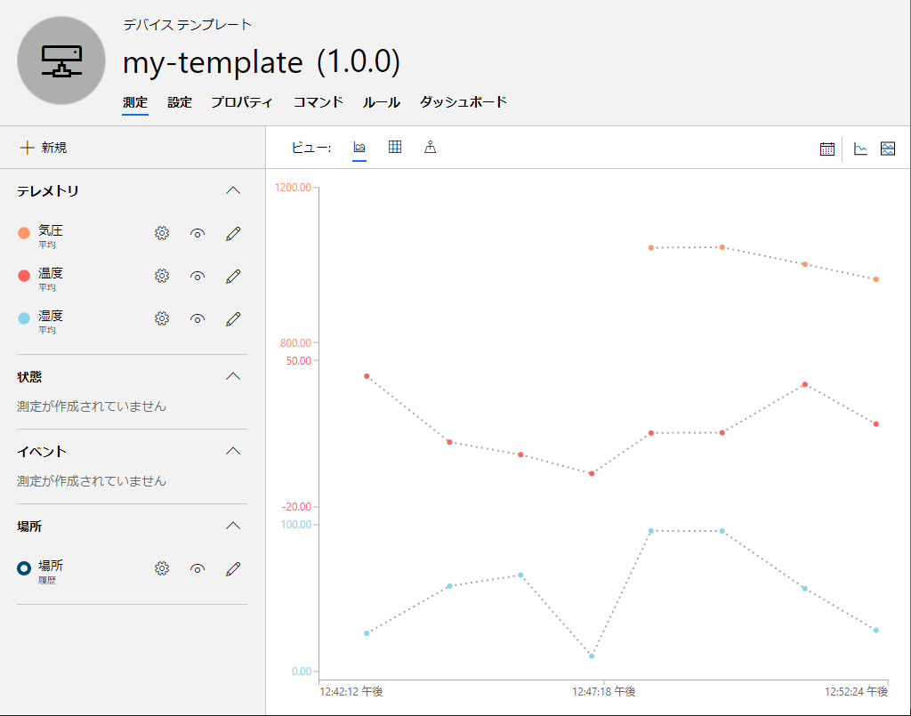

### 2-3. ダッシュボードを設定しよう

受信データの設定が終わったところで、ダッシュボードを設定してみましょう。  
ダッシュボードは、データの概要を一覧表示する画面(機能)です。

今回は以下のような画面を構成します。

- 温度・湿度のグラフ表示
- 過去30分間の温度・湿度の平均
- 機器がある場所を示すマップ

1. 「ダッシュボード」タブを表示します。  
    
	<br>

2. 「温度」を表示する折れ線グラフを追加します。  
   画面左の「折れ線グラフ」を選択し、以下の入力をします。  
    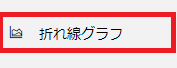

   - タイトル：温度
   - 凡例を表示する：On
   - X軸の表示：On
   - Y軸の表示：On
   - 時間の範囲：過去30分
   - 測定：「温度」を選択
   - 入力が完了したら「保存」をクリック。  

    
	<br>

3. 「湿度」を表示する折れ線グラフを追加します。  
   画面左の「折れ線グラフ」を選択し、以下の入力をします。
   
   - タイトル：湿度
   - 凡例を表示する：On
   - X軸の表示：On
   - Y軸の表示：On
   - 時間の範囲：過去30分
   - 測定：「湿度」を選択
   - 入力が完了したら「保存」をクリック。

    
	<br>

4. 温度の平均値表示を追加します。  
   画面左の「KPI」を選択し、以下の入力をします。  
    

   - タイトル：平均温度
   - 時間の範囲：過去30分
   - 測定タイプ：テレメトリ
   - 測定：温度
   - 入力が完了したら「保存」をクリック。

    
	<br>

5. 湿度の平均値表示を追加します。  
   画面左の「KPI」を選択し、以下の入力をします。

   - タイトル：平均湿度
   - 時間の範囲：過去30分
   - 測定タイプ：テレメトリ
   - 測定：湿度
   - 入力が完了したら「保存」をクリック。

    
	<br>

6. 機器の場所を表示するマップを追加します。  
   画面左の「マップ」を選択し、以下の入力をします。  
    

   - タイトル：設置場所
   - 場所：場所
   - 状態の測定：状態の測定を選択する。
   - 場所の履歴を表示する：Off
   - 入力が完了したら「保存」をクリック。

    
	<br>

追加したグラフやデータの表示位置は、自由に変更できます。  
自分好みの配置にしてみましょう。  
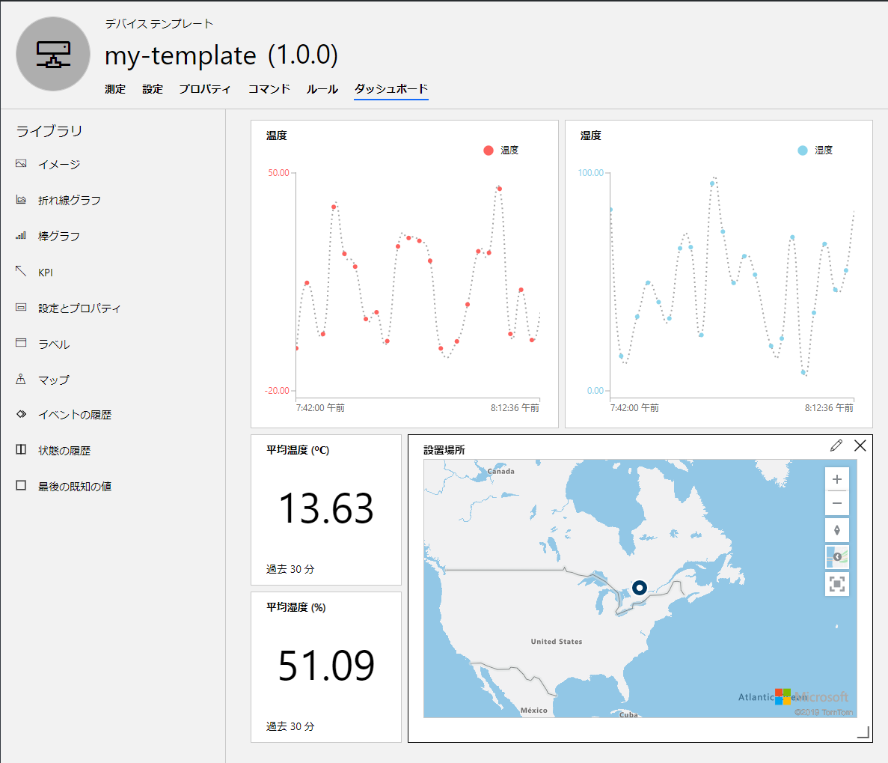
<br>

## 3. デバイスをつないでみよう

では、機器を接続してみましょう。

IoT機器をIoT Centralに接続するには、以下の手続きが必要です。

- IoT Centralに接続する機器を登録します。
- IoT機器がIoT Centralに接続するために必要な接続情報をAzureポータルから取得します。
- IoT Centralに接続しデータを送信するアプリを作成。接続に必要な情報は、このアプリに埋め込みます。
- IoT機器にアプリをデプロイし、起動します。

### 3-1. 接続機器を登録しよう

IoT Centralに接続機器を登録します。

1. 画面左のメニューから「デバイス」を選択します。  

   
   <br>

2. 先程作成した「my-template」が表示されています。  
   右側には、このテンプレートを利用した接続機器が表示されます。  
   まだ機器の登録を行っていませんが、既に  
     「my-template-1 (シミュレート済み)」  
   が存在しています。 これはIoT Centralが自動で作成したものです。  
   このシミュレート済み機器があったので、テンプレート作成時にデータが表示されました。  
   実際の機器を登録する場合には、「＋」をクリックし「実際」をクリックします。  
   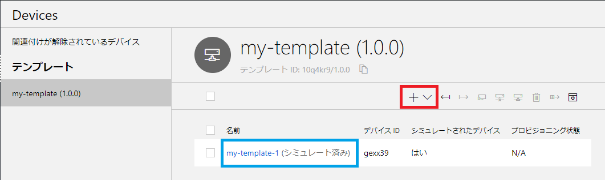
   <br>

3. 「新しいデバイス作成」ダイアログが表示されます。  
   デバイスIDとデバイス名が表示されていると思います。  
   今回は、これをこのまま使用しましょう。  
   「作成」をクリックします。  
   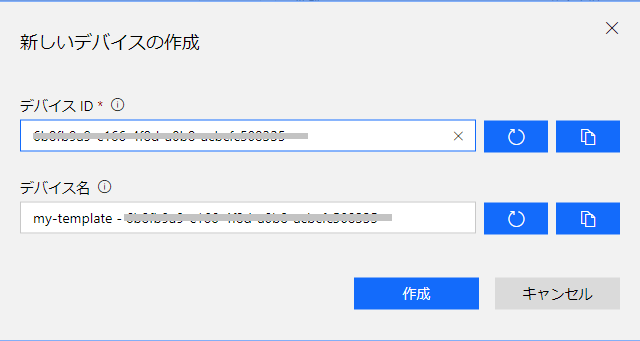
   <br>

4. デバイス登録が完了すると、画面が切り替わります。  
   これで、接続デバイスが登録されました。  
   
   <br>

### 3-2. 接続に必要な情報を取得しよう

デバイスをIoT Centralに接続するには、セキュリティを担保するため認証が必要になります。

IoT Central では

- SAS (Shared Access Signature：共有アクセス署名)

または

- X.509証明書

を利用した接続ができます。

今回は、SASを利用します。

1. 画面右上の「接続」をクリックします。  
   
   <br>

2. デバイス接続情報のダイアログが表示されます。  
   スコープID、デバイスIDを控えてください。  
   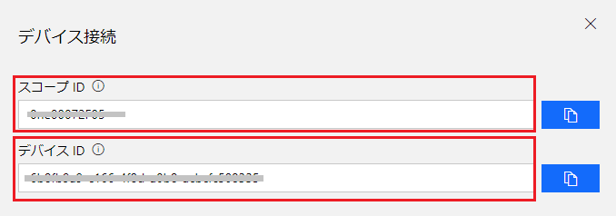
   <br>

3. 資格情報のSASタブを選択してください。  
   主キーとセカンダリキーが表示されていますので、それぞれ控えてください。  

   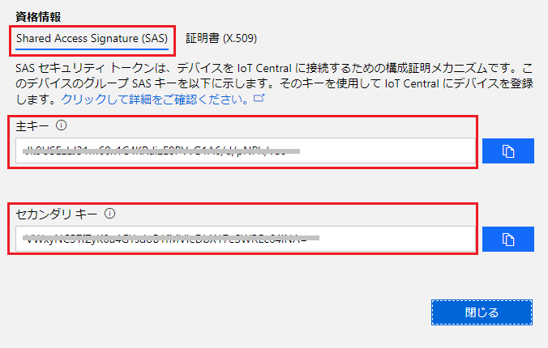
   <br>

   控えたら、「閉じる」をクリックしダイアログを閉じてください。  

   <br>

4. これらの情報から接続文字列を作成します。
   以下のサイトにアクセスしてください。
  
   [https://dpsgen.z8.web.core.windows.net/](https://dpsgen.z8.web.core.windows.net/)

   先程控えた、スコープID、デバイスID、主キーを入力し、  
   「Get Connection String」をクリックします。  
   しばらくすると接続文字列が表示されますので、控えておいてください。

   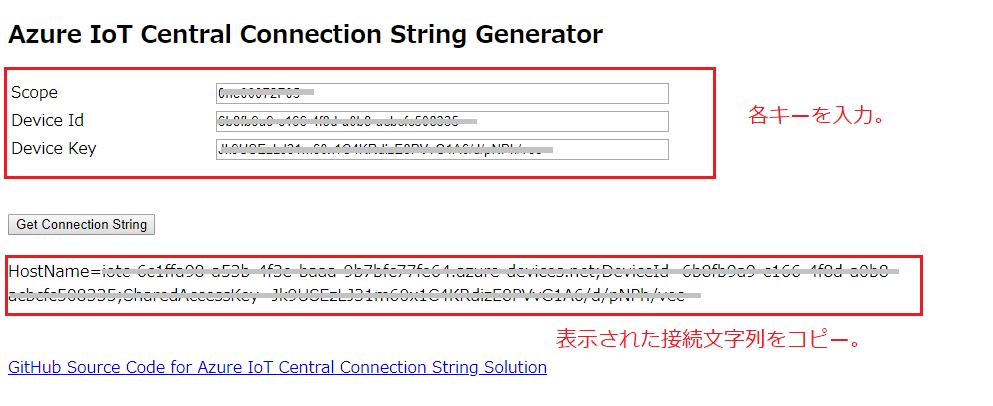

   <br>

<details>
<summary>参考：接続文字列の生成</summary>

接続文字列の生成には、Node.jsを利用したdps-keygenを利用しています。  
詳しくは以下を参照してください。

> Azure IoT Central アプリケーションに接続するためのデバイスの接続文字列を生成する  
> https://docs.microsoft.com/ja-jp/azure/iot-central/howto-generate-connection-string

</details>

<br>

### 3-3. IoT機器にデプロイする接続アプリを準備しよう

さて、IoT Centralに接続するための準備が整いました。

あとは、デバイスに接続アプリをデプロイするだけです。

本来であれば、ArduinoやRaspberry PiをはじめとしたIoT機器を接続したいところですが、  
今回は、Raspberry Piのシミュレータを実機にみたてて接続してみます。

先ずは、シミュレータにアクセスしてみましょう。
以下にアクセスしてください。

[https://azure-samples.github.io/raspberry-pi-web-simulator/#Getstarted](https://azure-samples.github.io/raspberry-pi-web-simulator/#Getstarted)  


<br>

これは、Node.js/JavaScriptで書かれています。
<details>
<summary>参考(1)：Raspberry Pi オンライン シミュレーター</summary>

> 参考：Raspberry Pi オンライン シミュレーターの Azure IoT Hub への接続 (Node.js)  
> https://docs.microsoft.com/ja-jp/azure/iot-hub/iot-hub-raspberry-pi-web-simulator-get-started

</details>

<br>

このシミュレータでは、以下の制御をシミュレートします。

- センサー (BME280) を接続し、温度・湿度・気圧を測定。
- AzureのIoT HubやIoT Centralに接続し、テレメトリを送信。
- LEDを接続し、データ送信時に点灯させる。

<details><summary>参考(2)：シミュレータのコード内容</summary>

では、少しコードを見てみましょう。

ポイントをかいつまんで説明してみます。

Raspberry Piには

  - GPIO (汎用入出力：General-Purpose Input/Output)

と呼ばれる、ピンが備わっています。  
このピンにセンサーをつないで、データを取得します。  
もちろんUSB経由でデータを取得できるものもありますが、このGPIOを使うことが多いですね。  
このGPIOにアプリ側からアクセスには、I2C (Inter-Integrated Circuit) と呼ばれる  
シリアル通信方式でアクセスします。

機械に興味がない人には、少し面倒な話でしたが、こうした事を踏まえて見てみましょう。

冒頭に定数定義があります。
azure関連のライブラリや、センサーとして使用するBME280に関するライブラリを参照しています。
また、I2Cに関する記載もありますね。

ここで、覚えておいてほしいのは、`azure-iot-device`です。
このライブラリを使用してAzureとの接続を行います。
AzureではIoT機器の接続に関して、SDKを用意しています。
こうしたSDKを利用することで、面倒なプログラミングをせずとも  
容易にサービスを利用できるようになります。
サンプルも公開されていますので、うまく活用してください。
とりあえず試して結果を得るまでの速さを体験してください。

> Azure IoT Hub SDK の概要と使用方法  
> https://docs.microsoft.com/ja-jp/azure/iot-hub/iot-hub-devguide-sdks

さて、メソッドが定義されていますが主要なメソッドの概要を説明しましょう。
まず23行目の`getMessage()`ですが、SensorであるとかJSONと記載があります。
ここでは、センサー情報を読み取りテレメトリとして送信するJSONを作成しています。
温度や湿度のデータが記載されていますね。

次に、39行目の`sendMessage()`ですが、先程の`getMessage()`でJSONを取得し、
46行目の`client.sendEvent()`にてAzure側に送信しています。
この`client`が何者かは後程出てきます。

57行目からの`onStart()`と`onStop()`は開始コマンド及び停止コマンドに対するコールバックになります。
これも後で関連部分が出てきます。

79行目の`receiveMessageCallback()`ですが、これはクラウドからメッセージを受信したさいのコールバックになります。
受信したメッセージをコンソールに表示します。

99～108行目にかけては、センサー関連の処理を実施しています。
実際に利用するセンサーによって、こうした実装は異なります。
私の経験では、メーカーが利用に向けたサンプルコードを公開していることが
多いので、そうしたモノから引用することが多いです。

さて、111行目あたりからが重要です。
ここでは、IoT Hubのデバイスクライアントを生成しています。
5行目でazure-iot-deviceのクライアントを参照していますが、
このクライアントを生成しています。
`fromConnectionString()`メソッドに、接続文字列とプロトコルを渡していますね。

接続文字列は15行目に定数として定義しています。
設定値は`[Your IoT hub device connection string]`となっていますが、
もうお気づきですね、これを先程作成したIoT Centralへの接続文字列に置き換えます。
なお、プロトコルは7行目でMqttに設定しています。
MQTT(Message Queueing Telemetry Transport)は、
「 一つが小さい」メッセージを「大量」に「低遅延」「双方向」で通信することにむいています。
まさにIoT向けですね。
Azureでは他にもAMQPにも対応しています。
時間があれば調べてみてください。

さぁ、ざっと見てみましたが、ぱっと見渡せる量のコーディングで通信ができるなんてすごいですね。
早速つないで見ましょう。

</details>

<br>

コードを部分的に修正します。

1. 接続文字列を記載しましょう。  
   15行目の`[Your IoT hub device connection string]`の部分に、  
   先程控えておいた**接続文字列**を埋め込んでください。

<br>

2. 次に、送信データの作成部分を修正します。  

   機器からは、センサーで計測したデータを
   下記形式のJSONで送信することを想定しています。

   ```javascript
   // 送信例
   {
       "temperature": 28.0234,    // 温度
       "humidity": 56.2934,       // 湿度
       "pressure": 989.2229,      // 気圧
       "assetloc": {              // 場所
           "lon": 140.2220,       // 経度
           "lat": 39.0023         // 緯度
       }
   }
   ```

   23行目からの`getMessage()`メソッドを見てみましょう。  
   ここで送信メッセージを作成しています。  
   温度と湿度は設定されていますが、気圧と位置情報がありませんね。  
   以下のように変更しましょう。

   ```javascript
   function getMessage(cb) {
       messageId++;
	   sensor.readSensorData()
	   .then(function (data) {
		   cb(JSON.stringify({
			   messageId: messageId,
			   deviceId: 'Raspberry Pi Web Client',
			   temperature: data.temperature_C,
			   humidity: data.humidity,                     // 末尾に , を追加。
			   pressure: data.pressure_hPa * 100,           // 湿度を追加
			   assetloc: {lon: 140.329948, lat: 37.395753}  // 位置情報を追加
			}), data.temperature_C > 30);
		})
		.catch(function (err) {
			console.error('Failed to read out sensor data: ' + err);
		});
	}
   ```

これで準備ができました。

実行してみましょう。

「Run」をクリックすると動き始めますので、クリックしてください。  

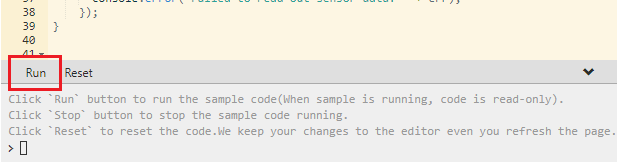
<br>
<br>

LEDが点灯し、画面右下のコンソールにメッセージが表示されていると思います。  

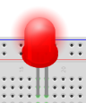
<br>
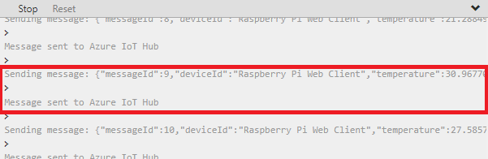  
<br>

IoT Central Applicationの画面に戻りましょう。  
「デバイス」から、登録した機器(実際の機器)を選択してください。

デバイスの「測定」画面が表示されると思いますが、グラフが表示されていますか？  
データがIoT Centralに届くと、プロットされると思います。

Raspberry Piシミュレータは、ランダムな値を送ってくるのでばらつきがありますが  
時間とともにどんどんプロットされます。

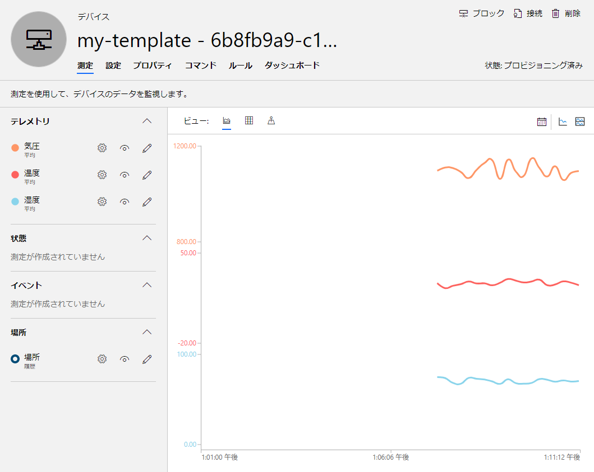

<br>

では、「ダッシュボード」を見てみましょう。
グラフや平均値などの表示はどうでしょうか。


<br>

マップですが、画面右側のボタンの一番下にある「始点」ボタンをクリックしてみてください。  
先程設定した位置情報は、FCSの位置なのですが、そのあたりにマーカーが表示されているでしょうか。  
実際のGPSセンサーをつなげば、移動体の位置もこれで表示できます。  

ここまでを振り返ってどうでしょう。

Raspberry Piシミュレータ側は若干コーディングしましたが、  
上がってきたデータの表示が、コーディング無しでできましたね。  

これまでは、データの蓄積や可視化を行うプログラムを作る必要がありましたが  
クラウドサービスを利用すれば、クリックと若干の文字入力で済むので  
サービス開始までの時間が大幅に短縮されます。  
これを使わない手はないですね。

## 4. ルールを設定してみよう

データの受信・可視化ができましたので、それをチェックするルールを設定してみましょう。

最近は、夏に猛暑日となる機会も増えてきました。  
熱中症を防止するため、温度が35℃を超えたらアラームメールを送信するようにしてみましょう。

1. デバイステンプレートから、「my-template」を選択してください。  

     
   <br>

  「ルール」タブを選択します。  

   
   <br>

2. 「＋新規」をクリックし、テレメトリを選択します。  

   
   <br>
 
3. 以下の入力を行います。  
   名前：熱中症注意
   このテンプレートのすべてのデバイスでルールを有効にします：On

4. 条件を追加します。「＋」をクリックしてください。

5. 測定：テレメトリの「温度」を選択します。

6. 集計：なしを選択。

7. 演算子：が次の値以上：

8. しきい値：35 を入力します。

9. 「保存」をクリックして保存します。  

   
   <br>

続いて、アクションを設定します。

1. アクションを追加します。「＋」をクリックしてください。

   
   <br>

2. 右側に実行可能なアクションが表示されますので、「電子メール」を選択してください。

   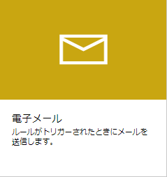
   <br>

3. 電子メール アクションを構成します。以下の入力をしてください。
   - 表示名：熱中症注意
   - 終了：通知先メールアドレス (携帯電話のメールをセットしてみてください)
   - メモ：気温が35℃を超えました。熱中症に注意してください。

   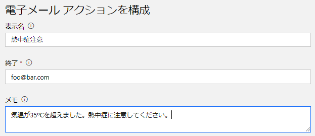
   <br>

4. 入力が完了したら、プレビューを確認します。  
   問題が無ければ、「保存」をクリックし保存します。  
   
   <br>

これで、メール送信設定ができました。

では、実際に送信されるかチェックしてみましょう。

先程の、[Raspberry Piシミュレータ](https://azure-samples.github.io/raspberry-pi-web-simulator/#Getstarted)を表示してください。  
Run状態であれば、一旦Stopしてください。

確実におくられるよう、送信データを細工します。

`getMessage()`を以下のように書き換えてください。

   ```javascript
   function getMessage(cb) {
       messageId++;
	   sensor.readSensorData()
	   .then(function (data) {
		   cb(JSON.stringify({
			   messageId: messageId,
			   deviceId: 'Raspberry Pi Web Client',
			   //temperature: data.temperature_C,    // 一旦コメントアウト
			   temperature: 38,	                 // 追加。38固定で送信
			   humidity: data.humidity,		
			   pressure: data.pressure_hPa * 100,
			   assetloc: {lon: 140.329948, lat: 37.395753}
			}), data.temperature_C > 30);
		})
		.catch(function (err) {
			console.error('Failed to read out sensor data: ' + err);
		});
	}
   ```

データを送信します。  

メッセージが送信できたら、Stopしてください。  
**止めないとメールがどんどん届くので注意してください**。

どうですか、届きましたか。

こういった感じで、送信データをチェックし、状況に応じたアクションを設定できます。  
設定できるアクションは、メールの他にもAzure FunctionsやLogic Appsなどがあります。  
それらを利用すれば、より複雑な制御を行うことも可能ですので、要件に応じ適した  
アクションを設定してください。

## 5. 料金

IoT Centralの料金ですが、**接続するデバイスが5台までは無料です。**  
**1デバイス当たり50,000メッセージ**が含まれます。  
(参考：1分間1メッセージぐらい)

追加メッセージは100万メッセージあたり￥560です。

開発には十分です。是非ためしてみてください。
