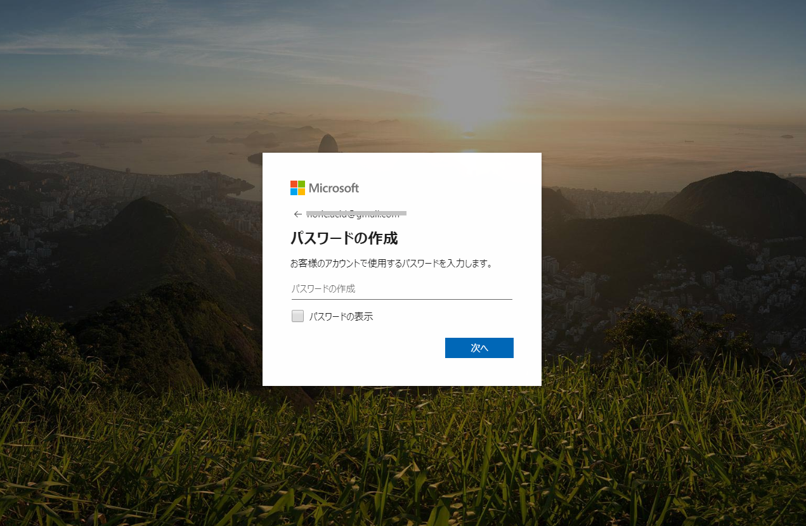

# Azure 無料アカウントの作成

## Azure 無料アカウントの作成

Azureを利用するにあたっては、アカウントの作成が必要となります。

Azureでは無料アカウントを作成することが出来ます。

**特徴**

- 12か月間の無料アクセス
- サインアップから最初の30日間で使用できる￥22,500のクレジット
- 25を超える常時無料製品へのアクセス

**アカウント作成に必要なもの**

- 電話番号
- クレジットカード または デビットカード
- Microsoftアカウント または GitHubアカウント

Microsoftアカウントをお持ちでない方は、以下の方法で作成してください。

**[新しい Microsoft アカウントを作成する方法](https://support.microsoft.com/ja-jp/help/4026324/microsoft-account-how-to-create)**

----
1. Microsoftアカウントを作成します。
   - [Microsoftアカウント](https://account.microsoft.com/account/Account?refd=support.microsoft.com&ru=https%3A%2F%2Faccount.microsoft.com%2F%3Frefd%3Dsupport.microsoft.com&destrt=home-index) のページにアクセスします。

2. 「Microsoftアカウントの作成」をクリックします。(下記図の赤枠部分)  

※メール確認

3. アカウント登録に使用するメールアドレスを入力し「次へ」をクリックします。

4. パスワードを入力し「次へ」をクリックします。

5. 先程入力したメールアドレス宛に、メールが届きます。  
   メール本文に「セキュリティコード」が記載されていますので、  
   そのコードを入力します。入力したら「次へ」をクリックします。

下記のようなメールが送信されますので、セキュリティーコードを入力してください。

6. 表示されたイメージの文字を入力し「次へ」をクリックしてください。

7. これでMicrosoftアカウントが作成されます。  
   作成が完了するとMicrosoftアカウントの画面に遷移します。

8. 支払い方法を設定します。

----

Azure 無料アカウントに関するFAQはこちらから
**[Azure 無料アカウントFAQ](https://azure.microsoft.com/ja-jp/free/free-account-faq/)**

Azure 無料アカウント作成はこちらから
**[Azure 無料アカウント作成](https://azure.microsoft.com/ja-jp/free/search/?&ef_id=EAIaIQobChMI6rSXh6O45AIVhqqWCh24KAMuEAAYASAAEgJLuPD_BwE:G:s&OCID=AID2000091_SEM_QNAR8cdD&MarinID=QNAR8cdD_324624681523_azure%20%E7%84%A1%E6%96%99%E3%82%A2%E3%82%AB%E3%82%A6%E3%83%B3%E3%83%88_e_c__64173008835_aud-390212648291:kwd-572204732787&lnkd=Google_Azure_Brand&dclid=CLfTuc2juOQCFca6lgod3_ADYw)**

