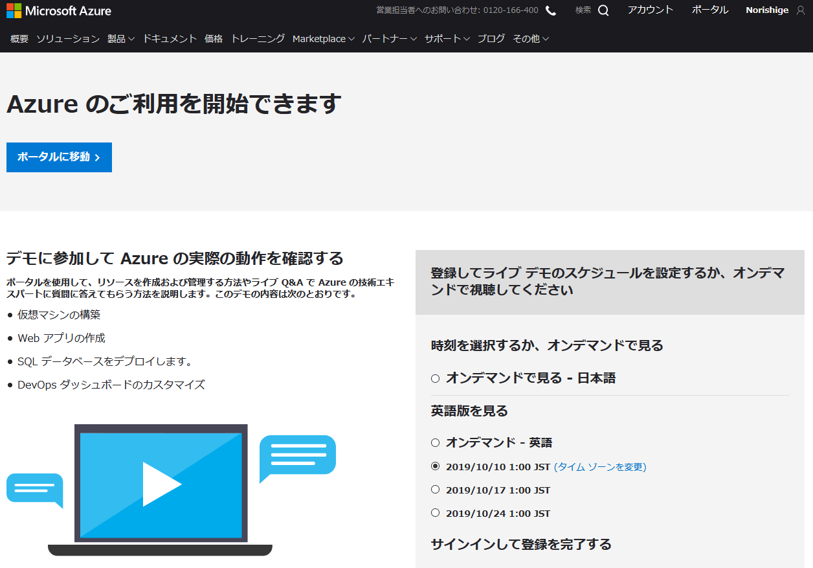

# Azure 無料アカウントの作成

## Azure 無料アカウントの作成

Azureを利用するにあたっては、アカウントの作成が必要となります。

Azureでは無料アカウントを作成することが出来ます。

**特徴**

- 12か月間の無料アクセス
- サインアップから最初の30日間で使用できる￥22,500のクレジット
- 25を超える常時無料製品へのアクセス

**アカウント作成に必要なもの**

- 電話番号
- クレジットカード または デビットカード
- Microsoftアカウント または GitHubアカウント

Microsoftアカウントをお持ちでない方は、以下の方法で作成してください。

----

**[新しい Microsoft アカウントを作成する方法](https://support.microsoft.com/ja-jp/help/4026324/microsoft-account-how-to-create)**

1. Microsoftアカウントを作成します。  
  [Microsoftアカウント](https://account.microsoft.com/account/Account?refd=support.microsoft.com&ru=https%3A%2F%2Faccount.microsoft.com%2F%3Frefd%3Dsupport.microsoft.com&destrt=home-index) のページにアクセスします。

2. 「Microsoftアカウントの作成」をクリックします。(下記図の赤枠部分)  

3. アカウント登録に使用するメールアドレスを入力し「次へ」をクリックします。  

4. パスワードを入力し「次へ」をクリックします。  

5. 先程入力したメールアドレス宛に、メールが届きます。  
   メール本文に「セキュリティコード」が記載されていますので、  
   そのコードを入力します。入力したら「次へ」をクリックします。  
 
下記のようなメールが送信されますので、セキュリティーコードを入力してください。  

6. 表示されたイメージの文字を入力し「次へ」をクリックしてください。  

7. これでMicrosoftアカウントが作成されます。  
   作成が完了するとMicrosoftアカウントの画面に遷移します。  

8. 支払い方法を設定します。  
   「支払い方法を設定する」(下記赤枠部分)をクリックします。  

※以降、ここではクレジットカード/デビットカードによる支払い設定について記載します。

9. 「クレジットカード/デビットカード」を選択。  
   「購入地」から "日本"を選択し、「次へ」をクリックします。  

10. 「名」、「姓」、「メールアドレス」を入力し、「次へ」をクリックします。  

11. カード情報及び住所について入力します。  
    入力が完了したら、「保存」をクリックします。  

12.  登録が完了すると、登録内容が表示されますので確認してください。  
    入力に誤りがあった場合は、「情報を編集します」をクリックし訂正してください。  

以上で、Microsoftアカウントの作成は完了です。

----

**[Azure無料アカウント作成](https://azure.microsoft.com/ja-jp/free/search/?&ef_id=EAIaIQobChMI2crM0KCC5QIVC66WCh2gjQHjEAAYASAAEgKg6PD_BwE:G:s&OCID=AID2000091_SEM_KFOIV6YM&MarinID=KFOIV6YM_324588349914_azure%20%E7%84%A1%E6%96%99_e_c__64173009755_aud-390212648331:kwd-439757288598&lnkd=Google_Azure_Brand&dclid=CMCAvdGgguUCFQxivQodLJUGwg)**

Microsoftアカウント または GitHubアカウントがあれば、Azureの無料アカウントの作成が可能です。

以下に、その作成方法を記載します。

1. [Azure無料アカウント作成](https://azure.microsoft.com/ja-jp/free/search/?&ef_id=EAIaIQobChMI2crM0KCC5QIVC66WCh2gjQHjEAAYASAAEgKg6PD_BwE:G:s&OCID=AID2000091_SEM_KFOIV6YM&MarinID=KFOIV6YM_324588349914_azure%20%E7%84%A1%E6%96%99_e_c__64173009755_aud-390212648331:kwd-439757288598&lnkd=Google_Azure_Brand&dclid=CMCAvdGgguUCFQxivQodLJUGwg)のページにアクセスします。  
「無料で始める」をクリックしてください。  

2. Microsoftアカウントのメールアドレスを入力し「次へ」をクリックします。  
   (GitHubアカウント利用する場合は、「GitHubアカウントでサインイン」を選択してください)  

3. パスワードを入力し「次へ」をクリックします。  

4. 氏名・メールアドレス・電話番号等を入力し、「次へ」をクリックします。  

5. クレジットカードによる本人確認を行います。  
   各種情報を入力し、「次へ」をクリックします。  

6. 規約に同意し、「サインアップ」をクリックします。  
   (情報の受け取りは、任意ですので必要に応じ選択してください。)  

7. 登録が完了すると、以下の画面が表示されます。  

   「ポータルに移動」をクリックすると、Azureのポータル画面に移動します。  

   これで、Azureを利用が可能となりました。  
   無料クレジット(￥22,500)が付与されますので、十分活用してください。  

----

Azure 無料アカウントに関するFAQはこちらから
**[Azure 無料アカウントFAQ](https://azure.microsoft.com/ja-jp/free/free-account-faq/)**
